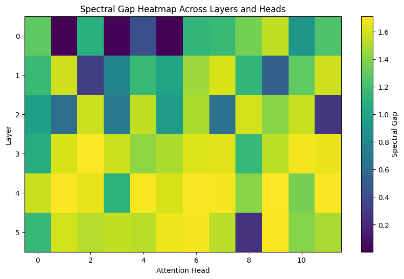
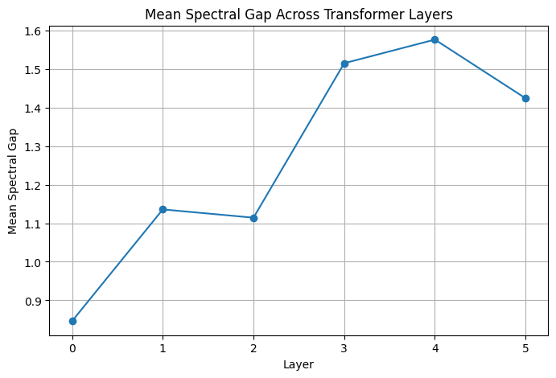
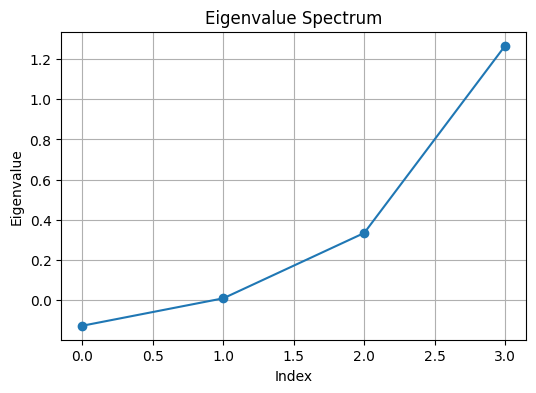
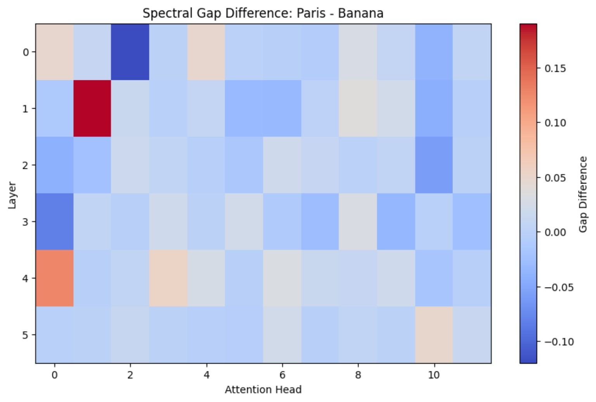

# Papers

## Current Paper

### Hamiltonian Interpretability and Hardware Mapping:
### Leveraging Quantum Twins for Mechanistic Verification of Generative Code

This exploratory paper investigates whether transformer attention dynamics admit useful operator-theoretic and spectral representations.

Topics include:

- spectral gap diagnostics
- symmetric surrogate operators
- attention-head perturbation analysis
- semantic stability measurements
- exploratory connections to quantum-inspired representations

## Related Figures

### Spectral Gap Heatmap

### Mean Spectral Gap Across Layers

### Eigenvalue Spectrum

### Spectral Gap Difference (Paris vs Banana)

## Status

Early exploratory work.
Results are preliminary and intended to guide future experimentation.
